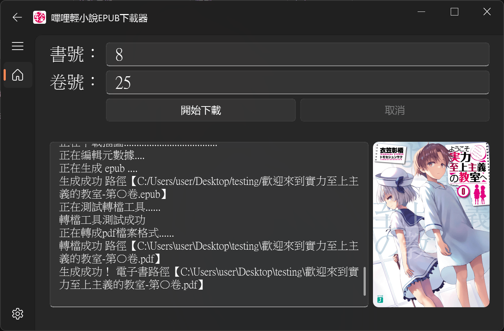
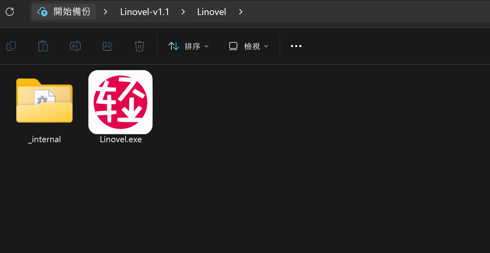

<p align="center">
   
</p>

<!---
- [簡介](#簡介)
- [安裝方法](#安裝方法)
- [使用方法](#使用方法)
- [設定](#設定)
- [鸣谢](#鸣谢)
-->

## 簡介
簡易使用的嗶哩輕小說下載工具 [TwLinovelDownloader]( https://github.com/sinkboy-chen/TwLinovelDownloader/releases)
  
- 特色
  - 圖形化介面，不需程式
  - 多種檔案格式輸出 (epub, mobi, pdf, txt...)
  - 簡體 / 繁體 輸出
  - 可以下載陸版哔哩轻小说 [(https://www.linovelib.com)](https://www.linovelib.com) 刪除的書籍
  - 無亂碼

- Screenshot
  

## 安裝方法
1. 下載解壓縮 Linovel-vX.X.zip [release](https://github.com/sinkboy-chen/TwLinovelDownloader/releases)


2. 若想輸出 epub 以外的檔案格式 下載安裝 [calibre](https://calibre-ebook.com/download) (非必要)

<details>
  <summary>補充 (for developers)</summary>
  
  1. if you want to run with python
  ```
  # 2024/07/04 tested with Python 3.11.4 on Windows 11
  git clone https://github.com/sinkboy-chen/TwLinovelDownloader.git
  cd TwLinovelDownloader
  pip install -r requirements.txt
  python bilinovel_gui.py
  ```

  2. if you want to pyinstall your own exe
  ```
  # 2024/07/04 tested with Python 3.11.4 on Windows 11
  git clone https://github.com/sinkboy-chen/TwLinovelDownloader.git
  cd TwLinovelDownloader
  pip install -r requirements.txt
  pip install pyinstaller
  pyinstaller -D -w -i .\resource\logo.png .\bilinovel_gui.py --name Linovel
  # the exe will be in TwLinovelDownloader\dist
  ```
</details>

## 使用方法
1. 根據書籍網址輸入書號以及下載的卷號，書號最多輸入 4 位阿拉伯數字。
1. 例如小說網址是 [https://tw.linovelib.com/novel/2117.html](https://tw.linovelib.com/novel/2117.html)，則書號輸入 2117。
1. 要查詢書籍卷號卷名等資訊，則可以只輸入書號不輸入卷號，點擊確定會返回書籍卷名稱和對應的卷號。
1. 根據上一步回傳的資訊決定自己想下載的卷號，若要下載編號[2]對應卷，卷號輸入 2。想下載多卷例如[1]至[3]對應卷，卷號輸入 1-3 或 1,2,3（英文逗號分隔，編號可以不連續）並點選確定。
1. 至設定頁面: 更改輸出檔案格式 (epub,mobi,txt,pdf..)、開啟/關閉功能。

<div align="center">
  
  
</div>

### 設定
<!--  -->

- 輸出檔案: 可選擇 epub, mobi, pdf, txt, azw3, lrf, oeb, pdb, rtf

  若選擇 epub 以外的選項，請先 [安裝 calibre 說明](#安裝方法)

- 翻譯成簡體: 取得的文字是繁體，是否翻譯成簡體

- 插圖頁面不存在時: 插圖頁面不存在時是否要手動添加插圖頁面章節 (建議Off)

## Credits
- 本项目的初始源代码来自 [ShqWW/bilinovel-download](https://github.com/ShqWW/bilinovel-download) 仓库。
- [calibre ebook-convert](https://calibre-ebook.com/download)
- [stoneapptech/epub_convert](https://github.com/stoneapptech/epub_convert)

有任何bug、建議可以提 issue or pull request

獻給保羅、魯迪烏斯和&nbsp;&nbsp;&nbsp;洛琪希

20240707
