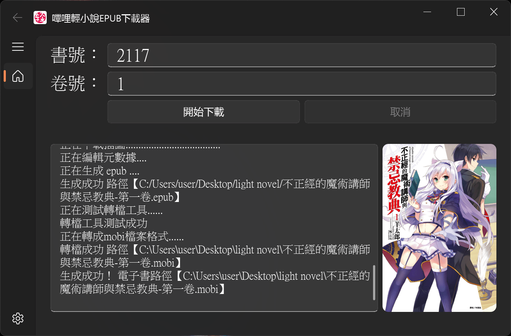
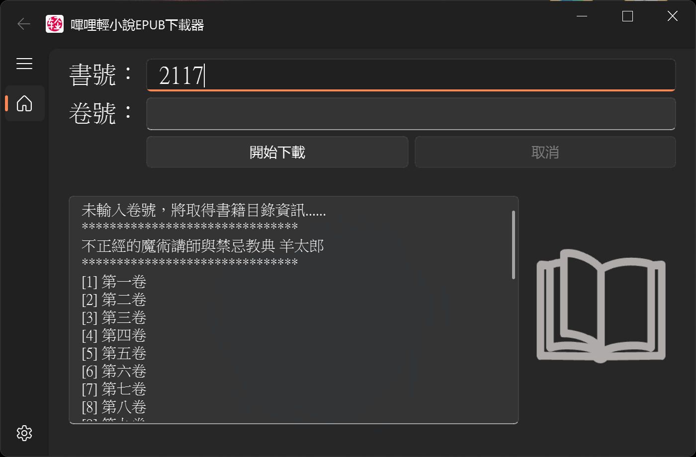
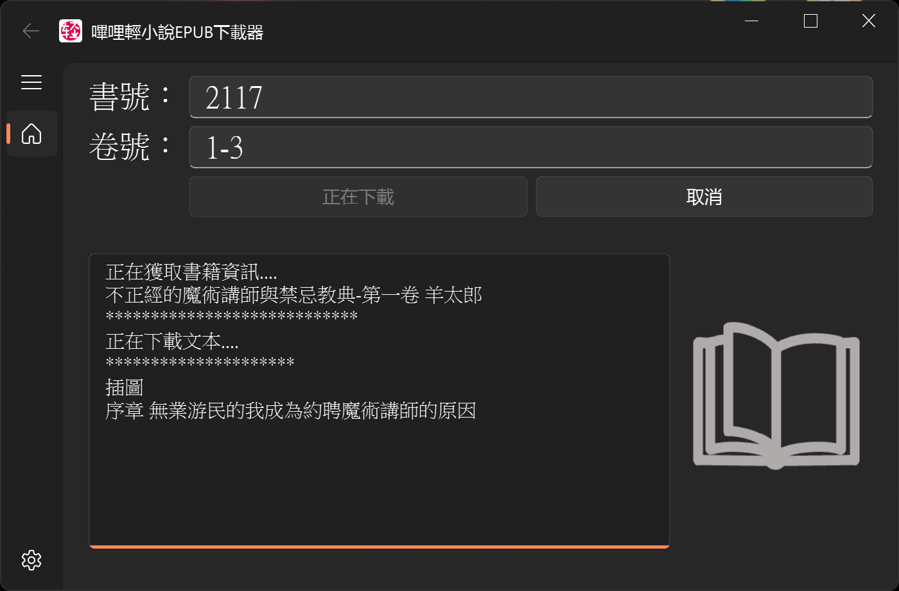
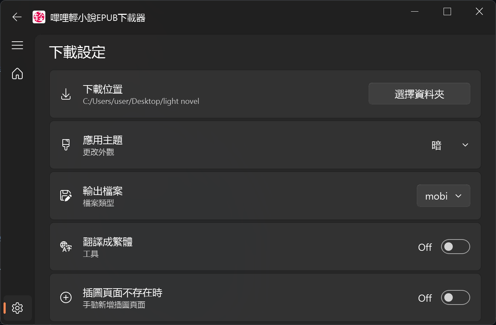

# (台版)嗶哩輕小說下載器

   

## 簡介
下載**台灣版**嗶哩輕小說書籍 [(https://**tw**.linovelib.com)](https://tw.linovelib.com) 成epub, mobi, pdf, txt...

> [!NOTE]
> 台灣以外的用戶請確認 必須可以訪問 [(https://**tw**.linovelib.com)](https://tw.linovelib.com) 方可正常運作
> 
> 替代使用 [ShqWW/bilinovel-download](https://github.com/ShqWW/bilinovel-download)

#### 缺點
1. **台灣以外的用戶可能無法使用**
1. 繁體

#### 優點
1. 繁體
1. **不須程式和指令** (圖形化介面、exe 直接執行)
1. **不須經常更新軟體** (使用動態爬蟲技術應對網站反爬更新)
1. **多種檔案格式輸出** (epub, mobi, pdf, txt...)
1. 可以下載 (陸版) 哔哩轻小说 [(https://**www**.linovelib.com)](https://www.linovelib.com) 刪除的書籍

#### Screenshot

## 安裝方法
TODO
### 下載  [calibre](https://calibre-ebook.com/download) (非必要)
> 若要輸出 epub 以外的檔案格式 (反之可跳過此步驟)

## 使用方法
1. 根據書籍網址輸入書號以及下載的卷號，書號最多輸入 4 位阿拉伯數字。
1. 例如小說網址是 [https://tw.linovelib.com/novel/2117.html](https://tw.linovelib.com/novel/2117.html)，則書號輸入 2117。
1. 要查詢書籍卷號卷名等資訊，則可以只輸入書號不輸入卷號，點擊確定會返回書籍卷名稱和對應的卷號。
1. 根據上一步回傳的資訊決定自己想下載的卷號，若要下載編號[2]對應卷，卷號輸入 2。想下載多卷例如[1]至[3]對應卷，卷號輸入 1-3 或 1,2,3（英文逗號分隔，編號可以不連續）並點選確定。
1. 至設定頁面: 更改輸出檔案格式 (epub,mobi,txt,pdf..)、開啟/關閉功能。

  
  

## 設定

### 輸出檔案
可選擇 epub, mobi, pdf, txt, azw3, lrf, oeb, pdb, rtf

若選擇 epub 以外的選項，請先 [安裝 calibre 說明](https://github.com/sinkboy-chen/tw-bilinovel-downloader/edit/main/README.md#calibre-%E9%9D%9E%E5%BF%85%E8%A6%81)

### 翻譯成繁體
取得的文字已是繁體，正常來說不用開啟 (建議Off)

### 插圖頁面不存在時
插圖頁面不存在時是否要手動添加插圖頁面章節 (建議Off)

## 鸣谢
- 本项目的初始源代码来自 [ShqWW/bilinovel-download](https://github.com/ShqWW/bilinovel-download) 仓库。
- [calibre ebook-convert](https://calibre-ebook.com/download)
- [stoneapptech/epub_convert](https://github.com/stoneapptech/epub_convert)

有任何bug、建議可以提 issue or pull request
